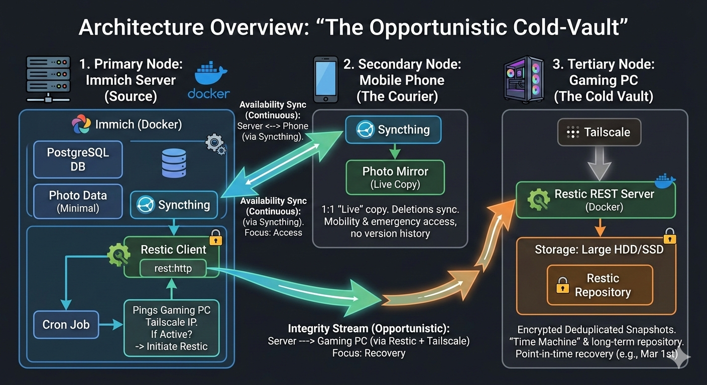

# Immich Backup with Restic

Automated backup solution for Immich using [restic](https://restic.net/) backup software.

## Architecture



## Prerequisites

- Docker and Docker Compose
- A restic repository server (e.g., [rest-server](https://github.com/restic/rest-server))
- Restic repository configured and accessible

## Quick Start

1. Copy the environment template:
   ```bash
   cp .env.example .env
   ```

2. Edit `.env` with your configuration:
   - `UPLOAD_LOCATION` - Path to your Immich media storage
   - `DB_DATA_LOCATION` - Path to your PostgreSQL database
   - `RESTIC_*` - Your restic repository credentials and server details
   - `BACKUP_INTERVAL_MINUTES` - How often to run backups (default: 15)

3. Start the backup service:
   ```bash
   docker compose up -d backup
   ```

## Configuration

| Variable | Description | Default |
|----------|-------------|---------|
| `UPLOAD_LOCATION` | Path to Immich media storage | - |
| `DB_DATA_LOCATION` | Path to PostgreSQL database | `./postgres` |
| `TZ` | Timezone | `America/Los_Angeles` |
| `IMMICH_VERSION` | Immich version tag | `v2` |
| `DB_PASSWORD` | PostgreSQL password | - |
| `RESTIC_HOST` | Restic server IP/hostname | - |
| `RESTIC_PORT` | Restic server port | `8000` |
| `RESTIC_USER` | Restic server username | - |
| `RESTIC_PASSWORD` | Restic server password | - |
| `RESTIC_REPO` | Restic repository URL | - |
| `BACKUP_INTERVAL_MINUTES` | Minutes between backups | `15` |

## Features

- **Connectivity Check**: Pre-checks if restic server is reachable before attempting backup (fails fast in ~10 seconds vs 15-minute restic timeout)
- **Timestamps**: Logs current sync time and next scheduled sync
- **Idempotent Init**: Safely initializes repository (skips if already exists)
- **Startup Delay**: 5-second delay before first backup attempt to allow services to initialize

## Troubleshooting

### Backup fails with "dial tcp i/o timeout"
The restic server is unreachable. Check:
- `RESTIC_HOST` and `RESTIC_PORT` are correct
- Network connectivity from the backup container
- The restic server is running

### Logs show "Server unreachable, skipping backup"
The connectivity check failed. The backup will be retried on the next interval.

### First time setup
Ensure your restic repository server is running and accessible before starting the backup container. You can test connectivity:
```bash
curl http://your_restic_host:your_restic_port/
```
